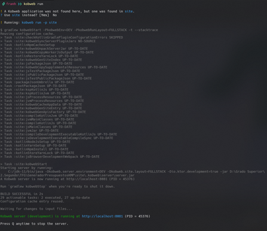

# Generador de Presupuestos - TFG

## Ejecución del proyecto

### Instalación de Java 23:

Para ejecutar el proyecto, es necesario tener instalado Java 23 (se requiere Java 16 o superior). Puedes descargarlo para tu sistema operativo desde:

- [Java 23](https://www.oracle.com/java/technologies/javase/jdk23-archive-downloads.html)
  
  (Asegúrate de que la ruta de instalación de Java esté añadida al PATH del sistema y la carpeta /bin/ a la variable JAVA_HOME de variables de entorno del sistema).


### Instalación de Kobweb:

Para ejecutar el proyecto, es necesario tener instalado Kobweb. Sigue estos pasos:

1. Instala Kobweb siguiendo las instrucciones en:
   - [Documentación oficial](https://kobweb.varabyte.com/docs/getting-started/gettingkobweb)
   - [Descargar binarios](https://github.com/varabyte/kobweb-cli/releases/tag/v0.9.18)

2. Añade Kobweb al PATH del sistema

3. Navega a la raíz del proyecto y ejecuta:
   ```
   kobweb run
   ```



## Descripción del proyecto

Este Trabajo Fin de Grado desarrolla una aplicación multiplataforma para la generación de presupuestos de mesas de trabajo, permitiendo a usuarios crear presupuestos mediante una interfaz intuitiva y a administradores gestionar precios y visualizar los presupuestos generados.

La principal ventaja es que utiliza Kotlin Multiplatform (KMP) y Compose Multiplatform (CMP) junto con Kobweb, permitiendo exportar la aplicación tanto como sitio web interactivo como aplicación nativa para Android desde una única base de código backend, el frontend está desarrollado en Kobweb para Web y CMP para Android.

## Tecnologías utilizadas

- **Kotlin Multiplatform**: Para compartir código entre plataformas
- **Compose Multiplatform**: Framework UI declarativo
- **Kobweb**: Framework para desarrollo web con Kotlin
- **MongoDB**: Base de datos NoSQL con driver oficial para Kotlin
- **JWT**: Autenticación basada en tokens
- **Gradle**: Sistema de gestión de dependencias

## Arquitectura

La aplicación sigue el patrón de diseño MVVM (Model-View-ViewModel) con clara separación entre:
- **Modelos**: Definición de datos (`User`, `Tramo`, `Mesa`, `Cubeta`, etc.)
- **Vistas**: Componentes UI en Compose (`LoginScreen`, `TableSelector`, etc.)
- **ViewModels**: Lógica de negocio y estados (mediante `BudgetManager`)

## Características principales

- **Autenticación segura**: Implementación de hashing SHA-256 para contraseñas y JWT para tokens
- **Interfaz adaptativa**: Diseño responsive que se ajusta a diferentes tamaños de pantalla
- **Persistencia de datos**: Gestión de configuraciones mediante localStorage
- **Flujo de selección guiado**: Proceso paso a paso para configurar presupuestos

## Estructura del proyecto

El proyecto está organizado en módulos:

- **commonMain**: Código compartido entre plataformas
- **jsMain**: Implementación específica para web usando Compose HTML y Kobweb
- **jvmMain**: Backend con Kobweb y MongoDB
- **androidapp**: Implementación para Android

### Componentes principales

- **Login**: Sistema de autenticación para usuarios y administradores
- **TableSelector**: Selección y configuración del tipo de mesa y dimensiones
- **ElementSelector**: Selección de elementos adicionales como cubetas y módulos
- **BudgetManager**: Gestor centralizado para los datos del presupuesto

## Flujo de usuario

1. **Login**: Autenticación del usuario
2. **Home**: Selección del tipo de presupuesto a generar
3. **TableSelector**: Configuración del tipo de mesa (1-4 tramos) y sus dimensiones
4. **TableElements**: Selección de elementos adicionales para la mesa (cubetas, petos, etc.)
5. **TableModules**: Selección de módulos para la mesa (bastidores, armarios, etc.)
6. **Resume**: Resumen del presupuesto y generación final
7. **PDFGenerator**: Generación de un PDF con el presupuesto y envío a la base de datos

## Seguridad

El sistema implementa varias capas de seguridad:
- Hashing SHA-256 para almacenamiento seguro de contraseñas
- Tokens JWT para autenticación de sesiones
- Verificación de rutas protegidas para usuarios no autenticados
- Encriptación de fórmulas de cálculo para usuarios sin permisos

## Estado del proyecto

Progreso:


### Implementado (✅)
- Sistema completo de autenticación con JWT
- Selección de tipo de mesa (1-4 tramos)
- Configuración de dimensiones y tipo para cada tramo
- Selección de elementos adicionales (cubetas de diferentes tipos y dimensiones)
- Selección de módulos (bastidores, armarios, cajoneras)
- Interfaz adaptativa para móvil y escritorio
- Validación de datos y mensajes de error
- Persistencia de datos en localStorage
- Integración con MongoDB
- Encriptación segura de fórmulas sensibles
- Panel de historial para seguimiento de presupuestos
- Panel de listas de materiales y elementos
- Cálculo final del presupuesto
- Generación de PDF del presupuesto
- Guardar presupuestos en la base de datos
- Desarrollo del módulo para Android

### Pendiente (⏳)
- Optimización y pruebas de rendimiento

## Dependencias principales

```
- Kotlin Multiplatform: 2.1.10
- Kobweb: 0.20.6
-MongoDB Driver: 5.3.0
-Compose: 1.7.3
-KotlinX Serialization: 1.4.1
-JWT: 4.2.1
-exp4j: 0.4.8
-KSP: 2.1.10-1.0.31
-Foundation Layout Android: 1.8.1
-Ktor: 2.3.2
-Core KTX: 1.16.0
-Lifecycle Runtime KTX: 2.9.0
-Activity Compose: 1.10.1
-Compose BOM: 2025.05.00
-Navigation: 2.9.0
-Coroutines: 1.8.1
-Mongo Sync: 2.3.0
-Coil: 3.1.0
-Retrofit: 2.9.0
-Retrofit Serialization: 1.0.0
```

## Licencia

Proyecto desarrollado como Trabajo Fin de Grado.