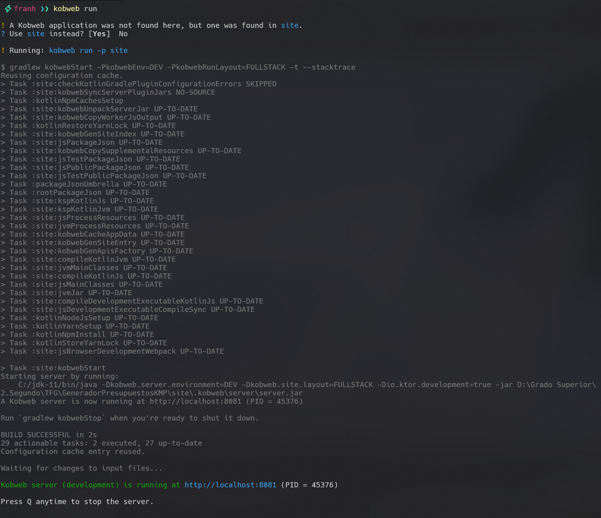

# Generador de Presupuestos - TFG

## Ejecución del proyecto

Para ejecutar el proyecto, es necesario tener instalado Kobweb. Sigue estos pasos:

1. Instala Kobweb siguiendo las instrucciones en:
   - [Documentación oficial](https://kobweb.varabyte.com/docs/getting-started/gettingkobweb)
   - [Descargar binarios](https://github.com/varabyte/kobweb-cli/releases/tag/v0.9.18)

2. Añade Kobweb al PATH del sistema

3. Navega a la raíz del proyecto y ejecuta:
   ```
   kobweb run
   ```



## Descripción del proyecto

Este Trabajo Fin de Grado desarrolla una aplicación multiplataforma para la generación de presupuestos de mesas de trabajo, permitiendo a usuarios crear presupuestos mediante una interfaz intuitiva y a administradores gestionar precios y visualizar los presupuestos generados.

La principal ventaja es que utiliza Kotlin Multiplatform (KMP) y Compose Multiplatform (CMP) junto con Kobweb, permitiendo exportar la aplicación tanto como sitio web interactivo como aplicación nativa para Android desde una única base de código.

## Tecnologías utilizadas

- **Kotlin Multiplatform**: Para compartir código entre plataformas
- **Compose Multiplatform**: Framework UI declarativo
- **Kobweb**: Framework para desarrollo web con Kotlin
- **MongoDB**: Base de datos NoSQL con driver oficial para Kotlin
- **JWT**: Autenticación basada en tokens
- **Gradle**: Sistema de gestión de dependencias

## Arquitectura

La aplicación sigue el patrón de diseño MVVM (Model-View-ViewModel) con clara separación entre:
- **Modelos**: Definición de datos (`User`, `Tramo`, `Mesa`, etc.)
- **Vistas**: Componentes UI en Compose (`LoginScreen`, `TableSelector`, etc.)
- **ViewModels**: Lógica de negocio y estados (mediante `BudgetManager`)

## Características principales

- **Autenticación segura**: Implementación de hashing SHA-256 para contraseñas y JWT para tokens
- **Interfaz adaptativa**: Diseño responsive que se ajusta a diferentes tamaños de pantalla
- **Persistencia de datos**: Gestión de configuraciones mediante localStorage
- **Flujo de selección guiado**: Proceso paso a paso para configurar presupuestos

## Estructura del proyecto

El proyecto está organizado en módulos:

- **commonMain**: Código compartido entre plataformas
- **jsMain**: Implementación específica para web usando Compose HTML
- **jvmMain**: Backend con Kobweb y MongoDB
- **androidMain**: (Pendiente) Implementación para Android

### Componentes principales

- **Login**: Sistema de autenticación para usuarios y administradores
- **TableSelector**: Selección y configuración del tipo de mesa y dimensiones
- **BudgetManager**: Gestor centralizado para los datos del presupuesto

## Flujo de usuario

1. **Login**: Autenticación del usuario
2. **Home**: Selección del tipo de presupuesto a generar
3. **TableSelector**: Configuración del tipo de mesa (1-4 tramos) y sus dimensiones
4. **TableElements**: Selección de elementos adicionales para la mesa
5. **Summary**: Resumen del presupuesto y generación final

## Seguridad

El sistema implementa varias capas de seguridad:
- Hashing SHA-256 para almacenamiento seguro de contraseñas
- Tokens JWT para autenticación de sesiones
- Verificación de rutas protegidas para usuarios no autenticados

## Estado del proyecto

Progreso: 


### Implementado (✅)
- Sistema completo de autenticación con JWT
- Selección de tipo de mesa (1-4 tramos)
- Configuración de dimensiones para cada tramo
- Adaptación responsive para móvil y escritorio
- Persistencia de datos en localStorage
- Integración con MongoDB

### Pendiente (⏳)
- Finalizar pantallas de configuración adicional (materiales, extras)
- Implementar cálculos matemáticos para presupuestos
- Generación de PDF del presupuesto
- Panel de administración para gestión de precios
- Visualización y seguimiento de presupuestos generados
- Desarrollo del módulo para Android
- Optimización y pruebas de rendimiento

## Módulo Android (Futuro)

Se prevé la implementación de un módulo Android que compartirá:
- Lógica de negocio con el código común
- Modelos de datos
- Algoritmos de generación de presupuestos

El módulo Android tendrá UI nativa utilizando Compose y aprovechará las ventajas de la plataforma móvil.

## Dependencias principales

```
- Kotlin Multiplatform: 2.1.10
- Kobweb: 0.20.0
- MongoDB Driver: 5.3.0
- Compose: 1.7.1
- KotlinX Serialization: 1.4.1
- JWT: 4.0.0
```

## Licencia

Proyecto desarrollado como Trabajo Fin de Grado.